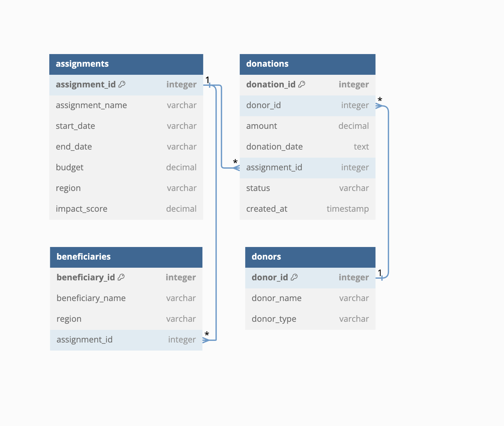
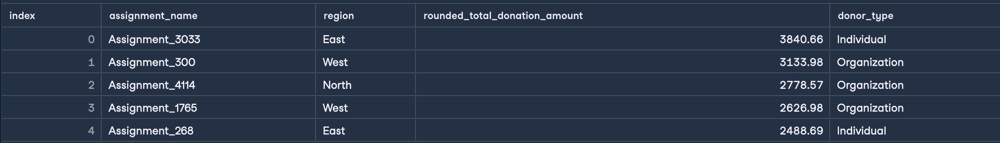
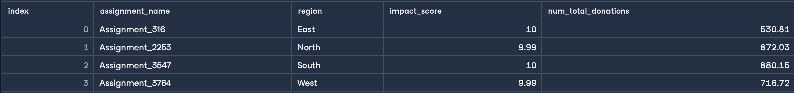

<h1>Impact-Analysis-of-GoodThought-NGO-Initiatives</h1> 
<h3>Datacamp</h3> 

GoodThought NGO has been a catalyst for positive change, focusing its efforts on education, healthcare, and sustainable development to make a significant difference in communities worldwide. With this mission, GoodThought has orchestrated an array of assignments aimed at uplifting underprivileged populations and fostering long-term growth.

This project offers a hands-on opportunity to explore how data-driven insights can direct and enhance these humanitarian efforts. In this project, we'll engage with the GoodThought PostgreSQL database, which encapsulates detailed records of assignments, funding, impacts, and donor activities from 2010 to 2023. This comprehensive dataset includes:

<ul>
  <li><b>Assignments:</b> Details about each project, including its name, duration (start and end dates), budget, geographical region, and the impact score.</li>
  <li><b>Donations:</b> Records of financial contributions, linked to specific donors and assignments, highlighting how financial support is allocated and utilized.</li>
  <li><b>Donors:</b> Information on individuals and organizations that fund GoodThought’s projects, including donor types.</li>
</ul>

Refer to the below ERD diagram for a visual representation of the relationships between these

Top 5 highest_donation result:

Top regional impact result: 

<h3>Note:</h3>The code is in code Folder, and tables are csv files

